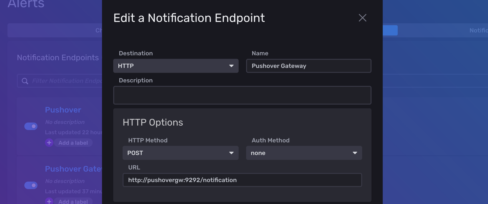
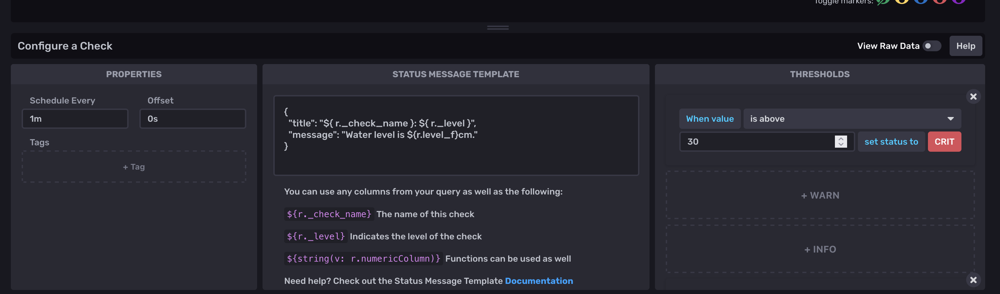

# influx-pushover-gateway

A notification gateway that translates InfluxDB2 HTTP notifications for the Pushover API.

## Getting started

Here is a sample `docker-compose.yml` file that will run the gateway:

```yaml
version: "3"
services:
  pushovergw:
    image: docker.io/nickthecook/influx-pushover-gateway
    ports:
      - 8080:9292
    environment:
      - TOKEN=${PUSHOVER_TOKEN}
      - USER_TOKEN=${PUSHOVER_USER_TOKEN}
```

Get your Pushover TOKEN and USER_TOKEN from the Pushover web UI.

### Sending notifications via the gateway

With your gateway container running, you can configure a Notification Endpoint in InfluxDB 2:



The gateway:

- listens on port 9292 within its container
- responds to plain HTTP requests (i.e. no HTTPS)
- accepts POSTs of JSON data at `/notification`

Configure a Check to send a JSON payload that fits the [Pushover API spec](https://pushover.net/api):



For example:

```json
{
  "title": "${r._check_name} status is ${r._level}",
  "message": "Water level has risen to ${r.level_f}cm!"
}
```

In this example, `level_f` is a metric on the measurement that triggered the check. `_level` and `_check_name` are built-in InfluxDB values.

When InfluxDB sends this message to the gateway over HTTP, it will send a JSON payload with this message encoded inside a single JSON field. The gateway will decode the field that contains this JSON message and send it to Pushover as the payload of a notification.

In theory, although the gateway has been tested with `title` and `message`, you could include any fields that the Pushover API understands, such as `device`, `url`, `timestamp`, `sound`, etc.

With the Notification Endpoint and some Checks configured, just configure a Noticiation Rule to send alerts via the Pushover Gateway endpoint and you should receive nicely-formatted Pushover Notifications.

## Debugging

By default, the container will log responses in the widely-used Apache request log format:

```
172.26.0.3 - - [05/Mar/2022:19:37:15 +0000] "POST /notification HTTP/1.1" 204 - 0.5263
172.26.0.3 - - [05/Mar/2022:19:39:00 +0000] "POST /notification HTTP/1.1" 204 - 0.4621
172.26.0.3 - - [05/Mar/2022:19:43:00 +0000] "POST /notification HTTP/1.1" 204 - 0.4949
172.26.0.3 - - [05/Mar/2022:19:45:00 +0000] "POST /notification HTTP/1.1" 204 - 0.4725
```

If it receives a successful response from Pushover, it will log nothing about the requests it makes to that API. However, if there is any error POSTing to Pushover it will log the error.

You can configure the gateway to log full stack traces by setting the environment variable `DEBUG=true`.
